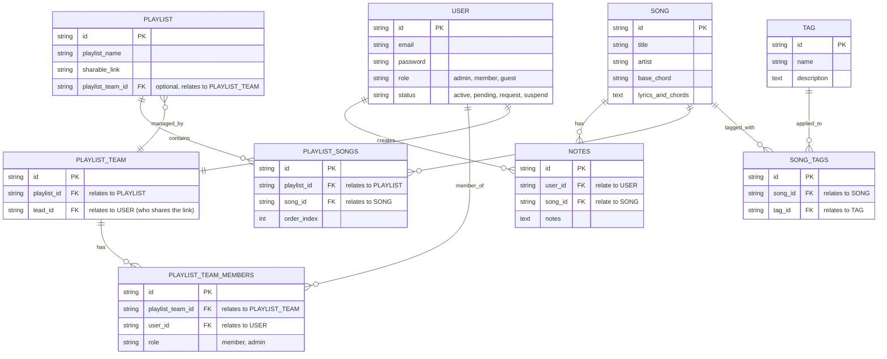

# 📊 Entity Relationship Diagram (ERD)

## Database Schema Overview

This document describes the database schema for the Songbanks API, showing the relationships between different entities in the system.

## ERD Diagram



## Entity Descriptions

### USER

Represents users in the system who can create playlists and participate in teams.

- **id** (PK): Unique identifier using ULID
- **email**: User's email address (unique)
- **password**: User's authentication password
- **role**: User role (enum: admin, user, moderator, etc.)
- **vol_id**: Volunteer ID or external reference

### SONG

Represents individual songs with their musical information.

- **id** (PK): Unique identifier using ULID
- **title**: Song title
- **artist**: Artist or composer name
- **base_chord**: Starting chord or key of the song
- **lyrics_and_chords**: Full lyrics with chord notations

### TAG

Represents categorization tags for songs.

- **id** (PK): Unique identifier using ULID
- **name**: Tag name (unique, e.g., "rock", "ballad", "worship")
- **description**: Optional description of the tag

### PLAYLIST

Represents collections of songs that can be shared and managed.

- **id** (PK): Unique identifier using ULID
- **playlist_name**: Name of the playlist
- **sharable_link**: Unique shareable URL for the playlist
- **playlist_team_id**: Optional reference to associated team

### PLAYLIST_TEAM

Represents collaborative teams that can manage playlists together.

- **id** (PK): Unique identifier using ULID
- **playlist_id**: Reference to the associated playlist
- **lead_id**: User ID of the team leader who can share links

### PLAYLIST_SONGS (Pivot Table)

Manages the many-to-many relationship between playlists and songs.

- **id** (PK): Unique identifier using ULID
- **playlist_id** (FK): Reference to the playlist
- **song_id** (FK): Reference to the song
- **order_index**: Position of song in playlist (for ordering)

### PLAYLIST_TEAM_MEMBERS (Pivot Table)

Manages the many-to-many relationship between playlist teams and users.

- **id** (PK): Unique identifier using ULID
- **playlist_team_id** (FK): Reference to the playlist team
- **user_id** (FK): Reference to the user
- **role**: Member role in the team (member, admin)

### SONG_TAGS (Pivot Table)

Manages the many-to-many relationship between songs and tags.

- **id** (PK): Unique identifier using ULID
- **song_id** (FK): Reference to the song
- **tag_id** (FK): Reference to the tag

## Relationships

### User to Notes

- **One-to-Many**: A user can create multiple notes
- **Each note belongs to one user and one song**

### Song to Notes

- **One-to-Many**: A song can have multiple notes from different users
- **Each note belongs to one user and one song**

### Playlist to Songs (via PLAYLIST_SONGS)

- **Many-to-Many**: A playlist can contain multiple songs, and a song can be in multiple playlists
- **Implemented via**: PLAYLIST_SONGS pivot table with order_index for song ordering
- **Benefits**: Proper referential integrity, indexing, and order management

### Playlist Team to Users (via PLAYLIST_TEAM_MEMBERS)

- **Many-to-Many**: A team can have multiple members, and a user can be in multiple teams
- **Implemented via**: PLAYLIST_TEAM_MEMBERS pivot table with role-based permissions
- **Benefits**: Role-based access control and proper team membership management

### Song to Tags (via SONG_TAGS)

- **Many-to-Many**: A song can have multiple tags, and a tag can be applied to multiple songs
- **Implemented via**: SONG_TAGS pivot table for efficient tag management
- **Benefits**: Normalized tag system, efficient queries, and tag reusability

### Playlist to Playlist Team

- **Many-to-One**: Multiple playlists can be managed by one team
- **Optional**: Playlists can exist without a team (individual playlists)

### User to Playlist Team (Leadership)

- **One-to-Many**: A user can lead multiple playlist teams
- **Direct relationship**: lead_id in PLAYLIST_TEAM table

## Data Types

### Primary Keys

- All primary keys use **ULID** format for better performance and URL safety
- ULIDs are 26-character strings that are sortable by creation time

### Text Fields

- **lyrics_and_chords**: Large text field for song content
- **notes**: Text field for additional information

### Enums

- **user.role**: Predefined user roles for access control (admin, member, guest)
- **user.status**: User status (active, pending, request, suspend)
- **playlist_team_members.role**: Team member roles (member, admin)

## Indexes

Comprehensive indexes for optimal performance:

```sql
-- User indexes
CREATE INDEX idx_users_email ON users(email);
CREATE INDEX idx_users_role ON users(role);
CREATE INDEX idx_users_status ON users(status);

-- Song indexes
CREATE INDEX idx_songs_title ON songs(title);
CREATE INDEX idx_songs_artist ON songs(artist);
CREATE INDEX idx_songs_base_chord ON songs(base_chord);

-- Tag indexes
CREATE INDEX idx_tags_name ON tags(name);

-- Notes indexes
CREATE INDEX idx_notes_user_id ON notes(user_id);
CREATE INDEX idx_notes_song_id ON notes(song_id);

-- Playlist indexes
CREATE INDEX idx_playlists_name ON playlists(playlist_name);
CREATE INDEX idx_playlists_team_id ON playlists(playlist_team_id);
CREATE INDEX idx_playlists_sharable_link ON playlists(sharable_link);

-- Playlist Team indexes
CREATE INDEX idx_playlist_teams_playlist_id ON playlist_teams(playlist_id);
CREATE INDEX idx_playlist_teams_lead_id ON playlist_teams(lead_id);

-- Pivot table indexes for performance
CREATE INDEX idx_playlist_songs_playlist_id ON playlist_songs(playlist_id);
CREATE INDEX idx_playlist_songs_song_id ON playlist_songs(song_id);
CREATE UNIQUE INDEX unique_playlist_song ON playlist_songs(playlist_id, song_id);

CREATE INDEX idx_playlist_team_members_team_id ON playlist_team_members(playlist_team_id);
CREATE INDEX idx_playlist_team_members_user_id ON playlist_team_members(user_id);
CREATE UNIQUE INDEX unique_team_member ON playlist_team_members(playlist_team_id, user_id);

CREATE INDEX idx_song_tags_song_id ON song_tags(song_id);
CREATE INDEX idx_song_tags_tag_id ON song_tags(tag_id);
CREATE UNIQUE INDEX unique_song_tag ON song_tags(song_id, tag_id);
```

## Business Rules

### User Management

- Users must have unique email addresses
- Users can have different roles with varying permissions (admin, member, guest)
- Users can participate in multiple teams through the PLAYLIST_TEAM_MEMBERS pivot table
- User status controls access (active, pending, request, suspend)

### Song Management

- Songs are standalone entities that can be reused across playlists
- Tags are managed as separate entities for consistency and reusability
- Song-to-tag relationships are managed through SONG_TAGS pivot table
- Lyrics and chords are stored together for easy display
- Each song can have multiple tags, each tag can be applied to multiple songs

### Playlist Management

- Playlists can be individual or team-managed
- Shareable links allow external access with unique URLs
- Song order is maintained through the order_index field in PLAYLIST_SONGS
- Playlist-to-song relationships are managed through PLAYLIST_SONGS pivot table
- Duplicate songs in the same playlist are prevented by unique constraints

### Team Collaboration

- Teams have one designated leader (lead_id in PLAYLIST_TEAM)
- Team membership is managed through PLAYLIST_TEAM_MEMBERS pivot table
- Team members can have different roles (member, admin) within the team
- Teams are optional for playlist creation (playlist_team_id can be null)
- Users can be members of multiple teams simultaneously
- Duplicate team memberships are prevented by unique constraints

### Tag Management

- Tags have unique names to prevent duplicates
- Tags can have optional descriptions for clarity
- Tag relationships with songs are normalized for better query performance
- Unused tags can be easily identified and cleaned up

## Future Considerations

### Potential Enhancements

1. **Song Versions**: Multiple arrangements of the same song
2. **Playlist History**: Track changes and versions
3. **User Permissions**: Fine-grained access control
4. **Song Ratings**: User feedback and popularity
5. **Practice Sessions**: Track team practice activities

### Scalability

- Pivot tables enable efficient querying and indexing for large datasets
- Consider partitioning large song collections and pivot tables
- Implement caching for frequently accessed playlists and tag queries
- Use read replicas for search operations across normalized tables
- Pivot table indexes optimize join performance for complex queries

### Performance Benefits of Pivot Tables

- **Better Query Performance**: Proper indexing on foreign keys enables fast lookups
- **Referential Integrity**: Foreign key constraints ensure data consistency
- **Flexible Querying**: Easy to query relationships without JSON parsing
- **Atomic Operations**: Add/remove relationships as individual transactions
- **Analytics Ready**: Pivot tables enable efficient aggregation queries
