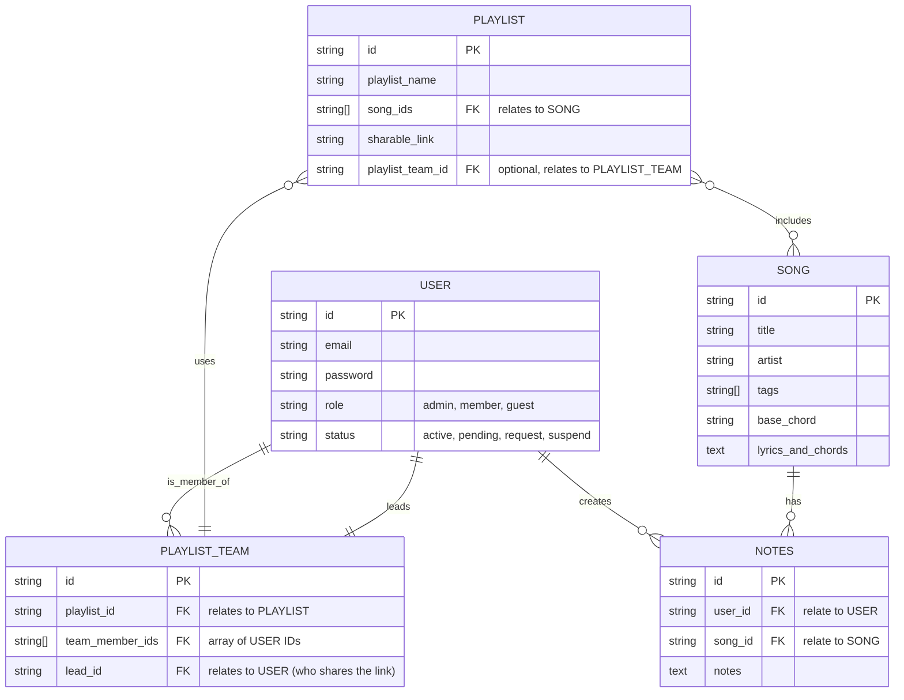

# 📊 Entity Relationship Diagram (ERD)

## Database Schema Overview

This document describes the database schema for the Songbanks API, showing the relationships between different entities in the system.

## ERD Diagram



## Entity Descriptions

### USER
Represents users in the system who can create playlists and participate in teams.

- **id** (PK): Unique identifier using ULID
- **email**: User's email address (unique)
- **password**: User's authentication password
- **role**: User role (enum: admin, user, moderator, etc.)
- **vol_id**: Volunteer ID or external reference

### SONG
Represents individual songs with their musical information.

- **id** (PK): Unique identifier using ULID
- **title**: Song title
- **artist**: Artist or composer name
- **tags**: Array of tags for categorization (genre, mood, etc.)
- **base_chord**: Starting chord or key of the song
- **lyrics_and_chords**: Full lyrics with chord notations
- **notes**: Additional notes or comments about the song

### PLAYLIST
Represents collections of songs that can be shared and managed.

- **id** (PK): Unique identifier using ULID
- **playlist_name**: Name of the playlist
- **song_ids**: Array of song IDs included in the playlist
- **sharable_link**: Unique shareable URL for the playlist
- **playlist_team_id**: Optional reference to associated team

### PLAYLIST_TEAM
Represents collaborative teams that can manage playlists together.

- **id** (PK): Unique identifier using ULID
- **playlist_id**: Reference to the associated playlist
- **team_member_ids**: Array of user IDs who are team members
- **lead_id**: User ID of the team leader who can share links

## Relationships

### User to Playlist Team
- **One-to-Many**: A user can be a member of multiple playlist teams
- **One-to-One**: A user can lead one specific playlist team

### Playlist to Playlist Team
- **Many-to-One**: Multiple playlists can be managed by one team
- **Optional**: Playlists can exist without a team

### Playlist to Song
- **Many-to-Many**: A playlist can contain multiple songs, and a song can be in multiple playlists
- **Implemented via**: Array of song IDs in the playlist entity

### Playlist Team to User
- **Many-to-Many**: A team can have multiple members, and a user can be in multiple teams
- **Implemented via**: Array of user IDs in the team entity

## Data Types

### Primary Keys
- All primary keys use **ULID** format for better performance and URL safety
- ULIDs are 26-character strings that are sortable by creation time

### Arrays
- **song_ids**: JSON array storing song references
- **tags**: JSON array for flexible tagging system
- **team_member_ids**: JSON array for team membership

### Text Fields
- **lyrics_and_chords**: Large text field for song content
- **notes**: Text field for additional information

### Enums
- **role**: Predefined user roles for access control

## Indexes

Recommended indexes for optimal performance:

```sql
-- User indexes
CREATE INDEX idx_users_email ON users(email);
CREATE INDEX idx_users_role ON users(role);

-- Song indexes
CREATE INDEX idx_songs_title ON songs(title);
CREATE INDEX idx_songs_artist ON songs(artist);
CREATE INDEX idx_songs_base_chord ON songs(base_chord);

-- Playlist indexes
CREATE INDEX idx_playlists_name ON playlists(playlist_name);
CREATE INDEX idx_playlists_team_id ON playlists(playlist_team_id);

-- Playlist Team indexes
CREATE INDEX idx_playlist_teams_playlist_id ON playlist_teams(playlist_id);
CREATE INDEX idx_playlist_teams_lead_id ON playlist_teams(lead_id);
```

## Business Rules

### User Management
- Users must have unique email addresses
- Users can have different roles with varying permissions
- Users can participate in multiple teams

### Song Management
- Songs are standalone entities that can be reused across playlists
- Tags allow for flexible categorization and search
- Lyrics and chords are stored together for easy display

### Playlist Management
- Playlists can be individual or team-managed
- Shareable links allow external access
- Song order is maintained through array positioning

### Team Collaboration
- Teams have one designated leader
- Team members can collaborate on playlist management
- Teams are optional for playlist creation

## Future Considerations

### Potential Enhancements
1. **Song Versions**: Multiple arrangements of the same song
2. **Playlist History**: Track changes and versions
3. **User Permissions**: Fine-grained access control
4. **Song Ratings**: User feedback and popularity
5. **Practice Sessions**: Track team practice activities

### Scalability
- Consider partitioning large song collections
- Implement caching for frequently accessed playlists
- Use read replicas for search operations